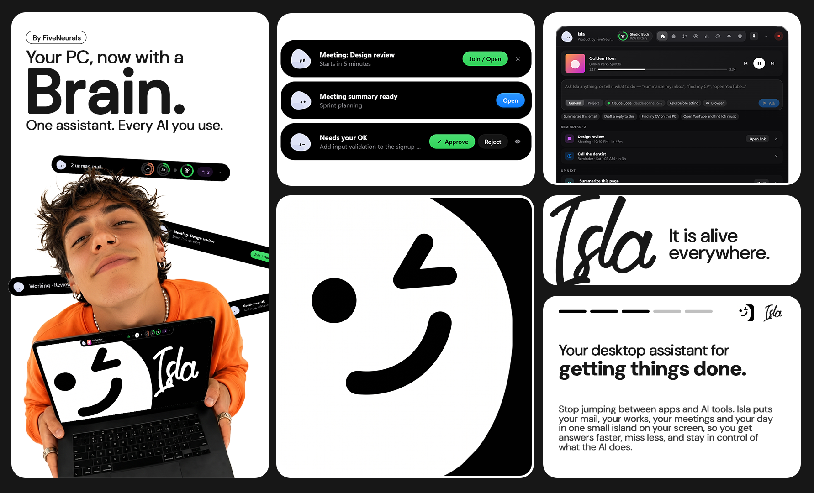

<div align="center">

  

  # Agentic Island

  **A macOS-style Dynamic Island for Windows with a proactive, privacy-first AI companion.**

  [](LICENSE)
  [-0078D6?logo=windows&logoColor=white)](https://github.com/SandaruAbey/Agentic-Island)
  [](https://www.electronjs.org/)
  [](https://www.typescriptlang.org/)
  [](https://react.dev/)
  [](https://github.com/SandaruAbey/Agentic-Island/pulls)

  <p align="center">
    <a href="#-quick-start">Quick Start</a> •
    <a href="#-key-features">Key Features</a> •
    <a href="#-ai-agent-integrations">AI Agents</a> •
    <a href="#-security--privacy">Security & Privacy</a> •
    <a href="#-plugin-system">Plugins</a> •
    <a href="#-developer-setup">Developer Setup</a> •
    <a href="#-license">License</a>
  </p>

  <br />

  

</div>

<br />

---

## 🌟 Overview

**Agentic Island** brings the fluid, unobtrusive **Dynamic Island** experience to Windows desktops, infused with an intelligent, proactive companion named **Isla**. 

Instead of opening heavy browser tabs or wrestling with complex terminal workflows, Agentic Island lives quietly flush against any screen edge as a sleek, interactive pill. Isla observes your workflow context, suggests immediate next steps, detects on-screen errors via offline Windows OCR, audits your git changes for leaked secrets, transcribes meetings, and dispatches tasks to the AI coding CLIs already on your machine (**Claude Code**, **Codex**, **Gemini CLI**, and **Antigravity**).

Built with **Electron**, **React 19**, and a high-performance native Windows helper (`native/IslaHelper.cs`), Agentic Island balances visual delight with strict local-first privacy.

---

## ✨ Key Features

### 🏝️ Fluid Dynamic Island on Any Screen Edge
- **Dock Anywhere:** Lives flush against the top, bottom, left, or right edge of your monitor. Drag the pill across the screen and let go—it smoothly glides to the nearest edge with a natural, bouncy landing animation. Turns into a vertical pill along side edges.
- **Tuck & Peeks:** Click the small tuck arrow or press `Ctrl+Alt+Space` to collapse Isla into a minimal screen tab. When tasks finish, emails arrive, or approvals are needed, the island dynamically expands with actionable peeks and auto-folds when done.
- **Live Now Playing Card:** Direct integration with Windows Media Session (YouTube, Spotify, Media Player, VLC, browser tabs). Displays live cover art, scrolling marquee titles, artist info, and full media transport controls (`⏮`, `⏯`, `⏭`).

### 🎭 Procedural Animated Avatar: Isla
- **Emotionally Reactive:** Isla isn't a static image. Her procedural SVG face dynamically expresses emotional states:
  - 😴 **Sleeping:** When you step away or activate the Kill Switch (stretches and wakes up when you return).
  - 🧐 **Suspicious:** When an agent is waiting for your explicit approval.
  - ⚡ **Working & Thinking:** While an AI agent CLI processes a task.
  - 🎉 **Dancing:** Whenever music or media is playing on your PC!
  - 🚨 **Confused / Alert:** When git merge conflicts or security alerts arise.

### 👁️ Zero-Cost Local Screen Perception (OCR)
- **Local Windows OCR:** Reads the foreground window using Windows' built-in WinRT OCR engine. Zero tokens used, zero latency, and runs 100% on your device.
- **Contextual Awareness:**
  - Detects runtime errors on screen → Offers *Explain & fix this error*.
  - Detects emails or long articles in browser → Offers *Summarize* or *Draft a reply*.
  - Detects foreign language text → Offers instant translation.
  - Recognizes open IDEs and automatically tracks the project's git repository.
- **Strict Exclusion:** Banking windows, password managers, and private/incognito tabs are blocked and ignored by default.

### 🌿 Intelligent Git Workflow & Secret Shield
- **1-Click Commit & Push:** Shows current branch, ahead/behind status, modified/staged files, and recent commit history.
- **Automated Local Pre-Commit Audit:** When your code stabilizes:
  1. Scans modified files locally for leaked secrets (API keys, private keys, `.env` files, hardcoded tokens).
  2. Generates concise conventional commit messages.
  3. Prevents accidental commits if files change after review or if secrets are flagged.

### 🎙️ Screen & Meeting Capture with Multilingual Summarization
- **Automatic Call Detection:** Detects when Zoom, Microsoft Teams, Google Meet, Discord, or Slack accesses your microphone and proactively offers to record.
- **Dual-Audio Capture:** Cleanly captures both your microphone and system audio (Windows WASAPI loopback) alongside crisp MP4 screen video.
- **Gemini Transcription & Action Items:** Summarizes decisions and action points, generating full transcripts supporting English, Sinhala, Tamil, and multilingual dialogue. The uploaded audio is immediately purged after processing.

### 📊 Real-Time AI Telemetry
- **Hardware & Token Rings:** Dual rings on the island pill display real-time usage (Claude Code real plan limits, Codex session limits, and token budgets).
- **Process Tracker:** Live CPU and memory usage monitoring for all local AI processes running on your system (Ollama, LM Studio, Claude, Cursor, Windsurf, Antigravity, ChatGPT).

---

## 🤖 AI Agent Integrations

Agentic Island leverages the tools already installed and authenticated on your machine:

| Agent | Integration Mechanism | Default Mode |
| :--- | :--- | :--- |
| **Claude Code** | Background execution with `--restricted` sandbox mode; reads real plan usage from local session logs. | Read-Only / Edit (with approval) |
| **OpenAI Codex CLI** | Sandboxed execution using `--sandbox read-only`. | Read-Only / Edit |
| **Google Gemini CLI** | Background task processing with zero external credentials required once logged in. | Read-Only / Edit |
| **Antigravity IDE** | Deep IDE integration: opens project workspaces and delivers prompt payloads via clipboard/IPC. | Interactive Workspace |
| **Custom CLI Agents** | Standard I/O bridge: prompts passed cleanly over `stdin` without shell injection risks. | Configurable |

---

## 🛡️ Security & Privacy

Agentic Island was designed from the ground up for strict enterprise-grade privacy and user consent:

- **Human-in-the-Loop Approvals:** File modifications, git push commands, and external network calls always trigger an interactive approval card displaying the exact command, agent, and diff before execution.
- **Local-First Processing:** OCR, secret scanning, media tracking, and window tracking run purely on-device without cloud dependencies.
- **Hardware Kill Switch:** Press `Ctrl+Alt+Shift+K` (or click the red stop button) to instantly terminate all running agent child processes, freeze watchers, and purge sensitive data from memory and clipboard.
- **Automatic Redaction:** API keys, session tokens, passwords, credit card numbers, and 2FA codes are automatically masked before any screen snippet reaches a language model.
- **Protected Secrets at Rest:** Sensitive credentials (such as Google OAuth tokens or IMAP configurations) are encrypted using the Windows Data Protection API (**Windows DPAPI** via `safeStorage`).
- **Sandboxed Renderer:** Strict Content Security Policy (CSP), context isolation, and sanitized IPC communication prevent web injection attacks.

---

## 🧩 Plugin System

Agentic Island features an extensible plugin engine running each plugin in an isolated utility process.

### Built-in: SEO Scout
An automated auditing engine for local businesses, marketing agencies, and developers:
- Discovers businesses on Google Maps (running in an isolated background browser instance—**no Google API key required**).
- Detects site tech stacks (WordPress, Shopify, Next.js, Laravel, Wix, WooCommerce, etc.).
- Performs **75+ SEO, AEO, and GEO checks** with Core Web Vitals performance benchmarks.
- Extracts emails, phone numbers, WhatsApp links, and social accounts.
- Generates downloadable `report.html` and exportable CSV datasets.

*(For detailed plugin documentation, see [plugins/README.md](plugins/README.md) and [plugins/seo-scout/README.md](plugins/seo-scout/README.md)).*

---

## 🚀 Quick Start

### Option 1: Pre-built Windows Installer

1. Download the latest installer from the [Releases](https://github.com/SandaruAbey/Agentic-Island/releases) page:
   ```text
   AgenticIsland-Setup-0.1.0.exe
   ```
2. Run the setup file. *(Note: Because the open-source binary is self-built and not signed with an expensive commercial certificate, Windows SmartScreen may show a prompt. Click **More info → Run anyway**).*
3. The Island will appear at the top of your screen, accompanied by a system tray icon.

### Option 2: Build & Run from Source

#### Prerequisites
- **Windows 10 / 11** (64-bit)
- **Node.js** v20.x or later
- **npm** v10.x or later
- **.NET Framework 4.x** (comes pre-installed with Windows; provides `csc.exe` to compile the native helper)
- At least one CLI coding agent installed (e.g., `npm i -g @anthropic-ai/claude-code`)

#### Installation Steps

```bash
# 1. Clone the repository
git clone https://github.com/SandaruAbey/Agentic-Island.git
cd Agentic-Island

# 2. Install dependencies
npm install

# 3. Start development mode with hot reload
npm run dev
```

#### Build Packaging

```bash
# Typecheck TypeScript files
npm run typecheck

# Build the native Windows helper & compile production bundle
npm run build

# Package standalone Windows NSIS installer (outputs to /release)
npm run dist
```

---

## ⌨️ Shortcuts & Controls

| Shortcut / Action | Action |
| :--- | :--- |
| `Ctrl + Alt + Space` | Show / Tuck the Dynamic Island |
| `Ctrl + Alt + Shift + K` | **Emergency Kill Switch** (Stops all agents & processes instantly) |
| **Hover Pill** | Expand quick peeks & assistant controls |
| **Drag Pill** | Reposition to top, bottom, left, or right screen edge |
| **Click Tuck Arrow (`^`)** | Collapse pill into edge tab |
| **Pin (`📌`)** | Lock the panel in expanded mode |

---

## 📁 Project Architecture

```text
Agentic-Island/
├── assets/                  # Brand assets, icons, and promotional showcase banners
├── build/                   # App icon and compiled native helper output
├── native/                  # High-performance C# Win32/WinRT helper (IslaHelper.cs)
│   └── IslaHelper.cs        # OCR, foreground window tracking, media session & audio hook
├── plugins/                 # Extensible plugin system
│   ├── isla-plugin.d.ts     # TypeScript definition for plugin development
│   └── seo-scout/           # Built-in multi-threaded local SEO & tech stack scout
├── scripts/                 # Build scripts (native helper compiler, makensis patches, installer)
├── src/
│   ├── main/                # Electron main process
│   │   ├── index.ts         # App lifecycle, window docking, tray, IPC dispatcher
│   │   ├── agents.ts        # CLI agent runner (Claude Code, Codex, Gemini, Antigravity)
│   │   ├── insight.ts       # Proactive engine (OCR analysis, auto git review, suggestions)
│   │   ├── screen.ts        # WinRT OCR & window capture interface
│   │   ├── context.ts       # Active application & window title tracker
│   │   ├── media.ts         # Windows media control & metadata integration
│   │   ├── git.ts           # Git status, branch tracking, and secret scanning
│   │   ├── store.ts         # Settings persistence and DPAPI encrypted secrets
│   │   └── plugins/         # UtilityProcess plugin worker host & sandboxing
│   ├── preload/             # Secure context bridges
│   ├── renderer/            # React 19 UI
│   │   ├── App.tsx          # Dynamic Island core shell & animation controller
│   │   ├── avatar/          # Isla's procedural animated SVG avatar engine
│   │   ├── panels/          # Home, Git, Recordings, Usage, Plugins, Settings panels
│   │   └── styles/          # Vanilla CSS tokens, glassmorphism, dynamic layouts
│   └── shared/              # Shared types, IPC channels, and protocol definitions
└── electron-builder.yml     # NSIS packaging configuration
```

---

## 🤝 Contributing

Contributions, bug reports, and feature requests are welcome!

1. Fork the Project
2. Create your Feature Branch (`git checkout -b feature/AmazingFeature`)
3. Commit your Changes (`git commit -m 'feat: add some amazing feature'`)
4. Push to the Branch (`git push origin feature/AmazingFeature`)
5. Open a Pull Request

---

## 📄 License

Distributed under the **MIT License**. See [`LICENSE`](LICENSE) for more information.

Copyright © 2026 **FiveNeurals**.
